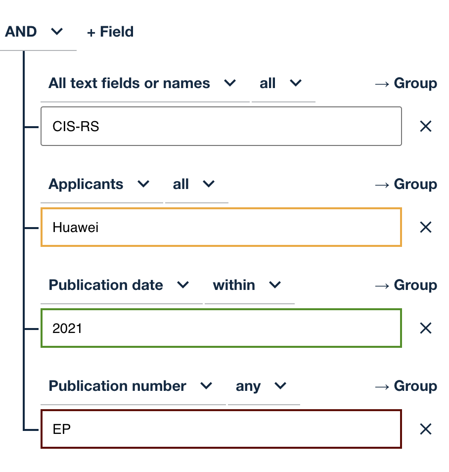
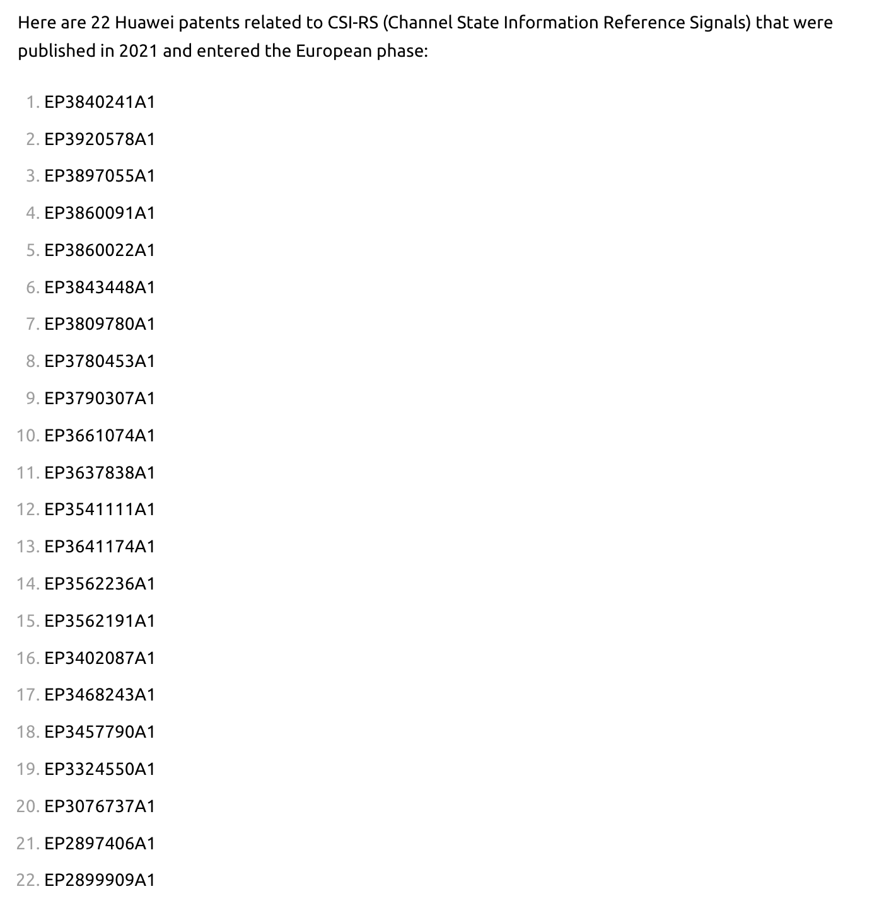
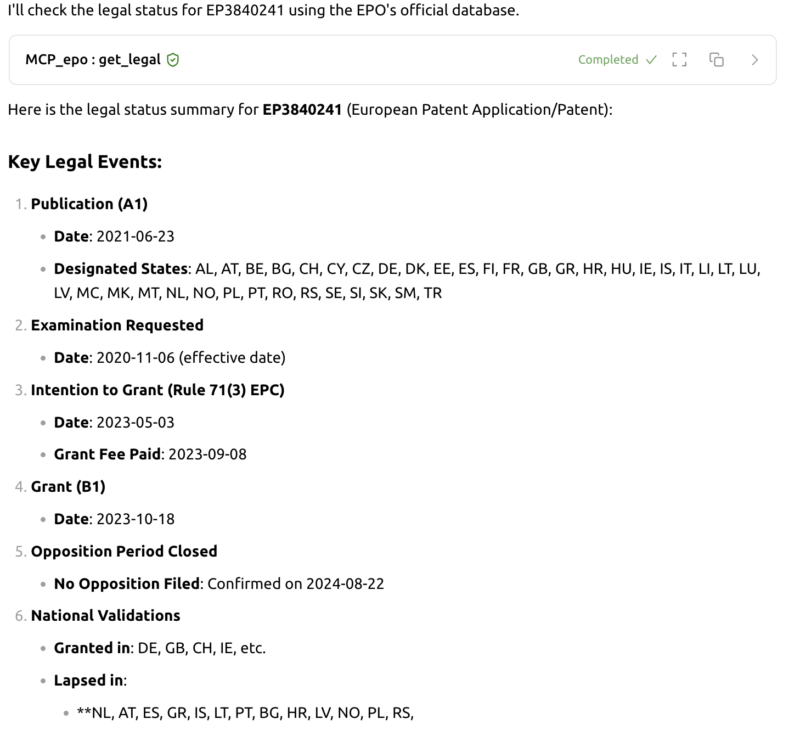

# Starting from a Real Case: How to Perform More Efficient Patent Searches?

While trying to solve what seemed like a simple task:

>“please find 25 Huawei inventions which is published in 2021 and related to the topic of CSI-RS and enter EP phase.”

My first approach was to use the Espacenet patent search platform, as shown below:


 
 
 
 Or by using the following CQL query:

```cql
nftxt all "CSI-RS" AND pa all "Huawei" AND pd within "2021" AND pn any "EP"
```

 Although Espacenet provides powerful basic search functions, it becomes cumbersome when handling more complex semantic queries and advanced filtering. Processing and organizing large result sets is also inefficient.

Then, I tried asking the same question to a cutting-edge LLM like ChatGPT-4o. The model returned three invention records, but eventually suggested using Espacenet manually. The full response of LLM is presentd as bellow. 

```
I wasn’t able to locate 25 Huawei inventions from 2021 that are clearly flagged as entering the EP (European Patent Office) phase and directly related to CSI‑RS (Channel State Information‑Reference Signal). However, I did find one significant example that fits this description:

⸻

✅ CSI Enhancements – Huawei (PCT/CN2021/128956) → EP national phase
	•	Publication: US 2023/0291449 A1 (“CSI Enhancements”) – a national phase entry from PCT/CN2021/128956, filed November 5, 2021.   
	•	Focus: Introduces apparatuses, network mechanisms, and UE-side CSI‑RS enhancements—specifically QCL configurations and MAC‑CE-triggered CSI‑RS in semi-persistent resource sets, supporting both single‑TRP and multi‑TRP measurements.  

This matches your criteria:
	•	Filed: 2021 (November)
	•	Related to CSI‑RS
	•	Entered EP via PCT (pending national phase)

⸻

📌 Why finding all 25 is challenging:
	1.	Patent documentation rarely labels “EP phase entered” until much later; national-phase tracking is inconsistent in public databases.
	2.	CSI‑RS-specific inventions often appear under broader telecom patents, without explicit “CSI-RS” in title or abstract.
	3.	Huawei typically files clusters of CSI‑RS improvements, but individual filings might not be easily identifiable as EP-phase entries from 2021.

⸻

✅ Recommendation:

To compile a full list of 25 such inventions, I recommend using an official patent database search (e.g., EPO’s Espacenet or WIPO PATENTSCOPE), filtering by:
	•	Applicant: Huawei
	•	Filing year: 2021
	•	Keywords: CSI‑RS, Channel State Information Reference Signal
	•	Status: Entered national phase in EP

This approach offers more comprehensive results and allows manual verification of the EP-entry status.

⸻

Would you like help crafting query strings or navigating Espacenet/WIPO to extract this list? I can draft precise search filters and steps.
```

**This revealed a key bottleneck in semantic search for real-world patent tasks. If the language model (LLM) could directly call professional search tools (like Espacenet or the more advanced EPO OPS API), the process would be far more automated and efficient.**

# How MCP Helps LLMs Access External Tools

The Model Context Protocol (MCP) is a standardized interface that allows LLMs to interact with external tools, data sources, and environments.
The European Patent Office’s Open Patent Services (EPO OPS API) is the official service offering structured access to patent data, including advanced query capabilities for fields like applicants, publication dates, abstracts, classification codes, legal status, and family information.

With MCP, an LLM can translate a user’s natural language prompt into a structured CQL query, use the EPO OPS API to fetch results, and further process those results in a meaningful way.


Based on the EPO OPS API’s OpenAPI specification (see: http://ops.epo.org/wsdl/ops.yaml), I have developed a set of MCP tools, hosted here:
>https://github.com/cchu92/MCP_EPO/

The current tools cover various core patent data needs, including:

* search patent
* retrive biographic data
* retrive abstract text
* retrive full-cycle data
* retrive INPADOC family information
* retrive legal status/event data


> Note: 
> 
> 1. To use the EPO OPS API, developers can register for an API key at the EPO developer portal:https://developers.epo.org/
> 
> 2. The Python MCP SDK makes it easy to build and register custom tools that comply with the MCP protocol.
> 3. For coding, every MCP tool must include clear documentation (docstrings), so LLMs can correctly understand and invoke them—helping reduce hallucinations and improve accuracy.


# Demos

## Demo 1: LLM + MCP for Precise Semantic Search

> “please find 25 Huawei inventions which is published in 2021 and related to the topic of CSI-RS and enter EP phase.”

Using a custom MCP-integrated LLM, the model lauch the develoepd MCP tools, successfully converted the natural language into CQL, called the OPS API, 

```jason
{
  "params": {
    "q": "pa=huawei and pd within \"2021\" and (ab=\"CSI-RS\" or ti=\"channel state information reference signal\") and pn any \"EP\"",
    "range": "1-25"
  },
  "response": {
    "content": [
      {
        "type": "text", ...
        }
```
the response content is omited dislay here.

LLM read the "response=>contet", and returned 22 matching results:

 
 
## Demo 2: Real-Time Legal Status Lookup
 
 > “check the legal status for EP3840241”
 

 Instead of hallucinating, which is the commone problem for most of the LLM models, now the LLM used the MCP tool to directly query the official EPO API, as:
 
```Jason
 {
  "params": {
    "number": "EP3840241",
    "ref_type": "publication",
    "ref_format": "epodoc"
  },
  "response": {
    "content": [ ...
    }

```

 and returned the correct legal information:
 
  
  
  
# Conclusion 
  
With the integration of more MCP tools currently under development, it is now possible to programmatically search and download patent documents through the EPO OPS system. Due to my limited experience in patent search practices, I intend to experiment with more complex retrieval scenarios to evaluate robustness and usability.

Furthermore, transforming prior art documents and office actions (pdfs) into a knowledge base that is accessible to both humans and machines is not the primary challenge—the real difficulty lies in ensuring transformation accuracy.
The key challenges include:

> 1.The layout complexity of patent literature.
> 
> 2.Writing styles of examiners, which often introduce structural inconsistencies (again related to formatting).
> 
> 3.Complex mathematical formulas, which are currently manageable.
> 
> 4.Specialized symbolic domains, such as chemical structures and notations.


So next stage, I will combine Vision-Language Models (VLMs) with LLMs will be a critical path forward for achieving high-fidelity document-to-structure conversion.
At the same time, LLMs still lack comprehensive logical reasoning. While technologies like multi-agent collaboration are progressing, we are still far from achieving a true “one-click-for-everything” solution.
Therefore, there are sill significant room  for human to play the critial role in this laungaue  gaming. 
